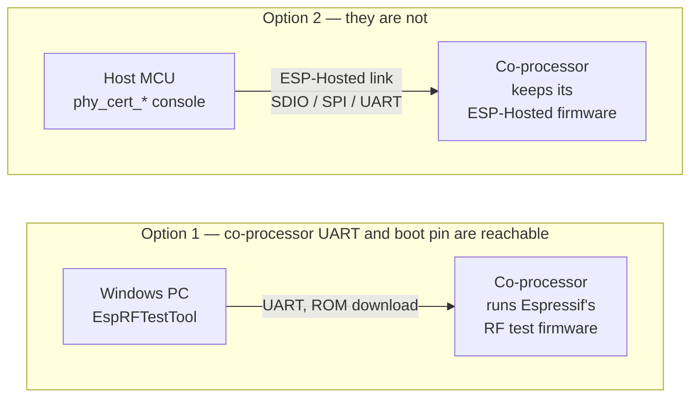

# RF Certification Test

[Home](../../README.md) · [Getting Started: Linux](../getting-started-linux.md) · [Getting Started: MCU](../getting-started-mcu.md) · [Troubleshooting](../troubleshooting.md)

Run the co-processor's PHY certification tests from the host. Transmit, receive
with error counts, or send a carrier tone — on Wi-Fi and on BLE.

For conducted measurement in a laboratory. This is not a product feature.

---

> [!CAUTION]
> ⚠️ **Never ship firmware with this enabled.**
>
> A host can put the radio into continuous transmit. A shipped device that
> accepts that command is a regulatory problem.
>
> The feature is off by default. It needs two separate opt-ins.

---

## Is this the right path for you?

Two ways exist to certify a hosted design. They are mutually exclusive, and
the board decides which one you get.



Option 1 replaces the co-processor's firmware, so ESP-Hosted takes no part
while the tool runs; reflash ESP-Hosted afterwards. It covers test items this
feature does not, such as Wi-Fi Adaptivity and 802.15.4.

Option 2 is what this feature adds. EspRFTestTool cannot reach a hosted
co-processor: it flashes a complete image in ROM download mode, which needs
the boot pin and the co-processor's own UART, and the ROM has no SDIO or SPI
channel for the hosted link to use.

---

## Who does what

The host owns the test. The co-processor only answers.

```text
   You                  Host                Co-processor          Antenna
    |                      |                      |                   |
    |  phy_cert_init       |                      |                   |
    |--------------------->|  enter cert mode     |                   |
    |                      |--------------------->|                   |
    |                      |                      |                   |
    |  phy_cert_esp_tx     |                      |                   |
    |--------------------->|  start TX            |                   |
    |                      |--------------------->|===== RF =========>|
    |                      |                      |                   |
    |  phy_cert_cmdstop    |                      |                   |
    |--------------------->|  stop                |                   |
    |                      |--------------------->|                   |
    |                      |                      |                   |
                                                              spectrum analyser
```

The co-processor starts nothing by itself. Every step is a command you type.

---

## Two different BLE tests

This is the part people mix up. ESP-Hosted gives you both, at different layers.

```text
                  ┌──────────────────────────┐
                  │       Host stack         │  NimBLE / Bluedroid
                  └──────────────────────────┘
                               │
   HCI DTM ────────────────────┤   controller-level
                               │   LE Transmitter/Receiver Test
                  ┌──────────────────────────┐
                  │      BT controller       │
                  └──────────────────────────┘
                               │
   this page ──────────────────┤   PHY-direct
   (phy_cert_esp_ble_*)        │   esp_phy_ble_tx / _rx
                  ┌──────────────────────────┐
                  │           PHY            │
                  └──────────────────────────┘
```

| | HCI DTM | This page |
| :--- | :--- | :--- |
| Goes through | BT controller | PHY only |
| Needs a host stack | No | No |
| Needs the controller | **Yes** | **No** |
| Reached over ESP-Hosted by | the HCI path | RPC |

Use DTM when a test house asks for BQB. Use this page for PHY-level
measurement, and when no controller is running.

---

## Chip support

A command is registered only if the co-processor has the radio for it.
Calling one the chip cannot run returns `ESP_ERR_NOT_SUPPORTED`.

| Co-processor | Wi-Fi commands | BLE commands | 802.11ax |
| :--- | :---: | :---: | :---: |
| ESP32-C5, ESP32-C6, ESP32-C61 | yes | yes | yes |
| ESP32, ESP32-C2, ESP32-C3, ESP32-S3 | yes | yes | no |
| ESP32-S2 | yes | no | no |
| ESP32-H2, ESP32-H4, ESP32-H21 | no | yes | no |

ESP32-P4 is absent on purpose: it has no radio, so it is a host here, never a
co-processor.

---

## What you need

**Co-processor** — both of these:

* `CONFIG_ESP_HOSTED_CP_FEAT_RF_CERT` — *ESP-Hosted CP → RF Certification Test*
* `CONFIG_ESP_PHY_ENABLE_CERT_TEST` — *Component config → PHY*

Set the first without the second and `menuconfig` warns you. The feature stays off.

**Host** — one:

* `CONFIG_ESP_HOSTED_HOST_FEAT_RF_CERT` — *ESP-Hosted Host → RF Certification Test*

Add `CONFIG_ESP_HOSTED_HOST_FEAT_CLI` for the `phy_cert_*` console commands.

| Linux host | MCU host |
| :---: | :---: |
| Yes | Yes |

---

## Cert mode takes the radio

```text
   ┌─────────────┐   phy_cert_init   ┌─────────────┐
   │   normal    │──────────────────>│  cert mode  │
   │  operation  │<───── restart ────│             │
   └─────────────┘                   └─────────────┘
                                            │  ^
                           phy_cert_esp_tx  │  │  phy_cert_cmdstop
                                            v  │
                                     ┌─────────────┐
                                     │ test running│
                                     └─────────────┘
```

Two rules follow from this:

* **Enter cert mode before Wi-Fi starts.** `phy_cert_init` fails with
  `ESP_ERR_INVALID_STATE` if the co-processor already initialised Wi-Fi.
* **Only a restart leaves cert mode.** `phy_cert_deinit` stops the test and powers
  the Wi-Fi domain down, but the PHY keeps its cert state.

---

## Commands and APIs

Each host call becomes one RPC. The co-processor runs the ESP-IDF API.

The native host API is `eh_host_phy_cert_*`, one call per ESP-IDF API, in
`eh_host_phy_cert.h` — the shape every other feature uses
(`esp_wifi_connect` → `eh_host_wifi_connect`). `esp_phy_remote.h` aliases the
same calls as `esp_phy_remote_*`, matching `esp_wifi_remote_*`, so ESP-IDF code
ports by adding the infix. Argument types come from `esp_phy_cert_test.h`
itself, which the host header includes. The return type is the one
difference: an RPC can fail where a local call cannot, so every host call
returns `esp_err_t` instead of `void`.

The **Also as** column is a second name for the same command, registered only
when `CONFIG_ESP_HOSTED_HOST_FEAT_RF_CERT_CLI_IDF_NAMES=y`. It is off by
default, so a stock build offers the `phy_cert_` names only.

**Session**

| Console command | Also as | Host API | ESP-IDF API |
| :--- | :--- | :--- | :--- |
| `phy_cert_init` | — | `eh_host_phy_cert_init()` | `esp_phy_rftest_config` + `esp_phy_rftest_init` |
| `phy_cert_deinit` | — | `eh_host_phy_cert_deinit()` | — |
| `phy_cert_query` | — | `eh_host_phy_cert_query()` | — |

**Wi-Fi**

| Console command | Also as | Host API | ESP-IDF API |
| :--- | :--- | :--- | :--- |
| `phy_cert_esp_tx` | `esp_tx` | `eh_host_phy_cert_wifi_tx()` | `esp_phy_wifi_tx` |
| `phy_cert_esp_rx` | `esp_rx` | `eh_host_phy_cert_wifi_rx()` | `esp_phy_wifi_rx` |
| `phy_cert_wifiscwout` | `wifiscwout` | `eh_host_phy_cert_wifi_tx_tone()` | `esp_phy_wifi_tx_tone` |
| `phy_cert_tx_contin_en` | `tx_contin_en` | `eh_host_phy_cert_tx_contin_en()` | `esp_phy_tx_contin_en` |
| `phy_cert_cbw40m_en` | `cbw40m_en` | `eh_host_phy_cert_cbw40m_en()` | `esp_phy_cbw40m_en` |
| `phy_cert_phy_11ax_tx_set` | `phy_11ax_tx_set` | `eh_host_phy_cert_11ax_tx_set()` | `esp_phy_11ax_tx_set` |

**Bluetooth LE**

| Console command | Also as | Host API | ESP-IDF API |
| :--- | :--- | :--- | :--- |
| `phy_cert_esp_ble_tx` | `esp_ble_tx`, `fcc_le_tx` | `eh_host_phy_cert_ble_tx()` | `esp_phy_ble_tx` |
| `phy_cert_esp_ble_rx` | `esp_ble_rx`, `rw_le_rx_per` | `eh_host_phy_cert_ble_rx()` | `esp_phy_ble_rx` |
| `phy_cert_bt_tx_tone` | `bt_tx_tone` | `eh_host_phy_cert_bt_tx_tone()` | `esp_phy_bt_tx_tone` |

**Any test**

| Console command | Also as | Host API | ESP-IDF API |
| :--- | :--- | :--- | :--- |
| `phy_cert_cmdstop` | `cmdstop` | `eh_host_phy_cert_test_start_stop()` | `esp_phy_test_start_stop` |
| `phy_cert_get_rx_result` | `get_rx_result` | `eh_host_phy_cert_get_rx_result()` | `esp_phy_get_rx_result` |
| `phy_cert_gpio_output_set` | `gpio_output_set` | `eh_host_cp_gpio_config()` + `_set_level()` | `gpio_config` + `gpio_set_level` |

`init`, `deinit` and `query` have no single ESP-IDF counterpart. `init` runs the
three calls that ESP-IDF's `cert_test` makes from `app_main`; `deinit` stops the
test and powers the radio down; `query` asks the co-processor what it supports
before you send a command. `esp_phy_remote.h` keeps ESP-IDF's spelling for the
first two (`esp_phy_remote_rftest_init` / `_rftest_deinit`).

Console command names, option letters, defaults and warning text are those of
the ESP-IDF `phy/cert_test` example. An engineer who has run that example types
the same commands here, and a script written against it moves over by changing
the serial port.

`gpio_output_set` drives a pin on the co-processor, so it goes through the GPIO
expander feature and is registered only when that feature is on.

One gap remains: the lines that `librftest.a` prints during a test (`I (...) phy: ...`) appear on the
co-processor console, not the host one — the host prints only the
`get_rx_result` line and errors, as the example does. Power attenuation steps are 0.25 dB, so 4 gives
1 dB. A packet count of `0` transmits until you stop it.

## Watchdog

A long transmit leaves the idle task no work and trips the task watchdog. Set
`CONFIG_ESP_TASK_WDT_EN=n` on the co-processor. The ESP-IDF `phy/cert_test`
example does the same.

---

## Start here

- [RF Certification Test example](../../examples/rf_cert/README.md) — console-driven
  sweeps for Wi-Fi and BLE.

---

## See also

- ESP-IDF [RF calibration](https://docs.espressif.com/projects/esp-idf/en/latest/esp32c6/api-guides/RF_calibration.html) — the `esp_phy_cert_test.h` reference
- ESP-IDF example `phy/cert_test` — the same APIs from a serial console
- [Bluetooth](bluetooth.md) · [Getting Started: MCU](../getting-started-mcu.md)
