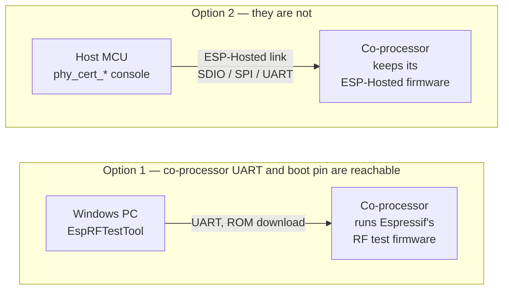
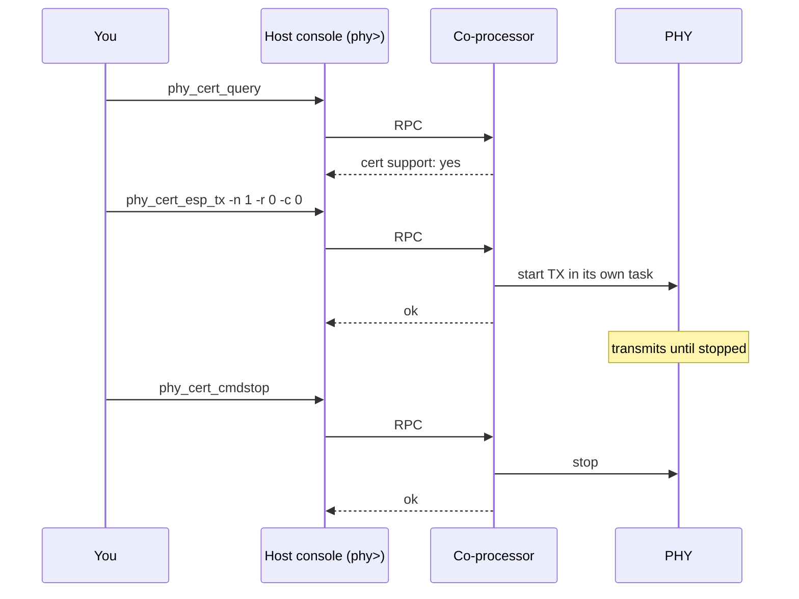

# rf_cert (`examples/rf_cert/`)

[Feature page](../../docs/features/rf-cert-test.md)

<!-- tags: rf-cert, phy, certification, conducted-measurement, wifi, ble, console -->

<!-- common-start -->
Drives the co-processor's PHY certification test APIs from a console on the
host. You type each step and read each result, so the sweep runs at your
pace, not the firmware's. Wi-Fi and BLE packet TX, RX with packet-error
statistics, and carrier-wave tone, on whichever radios the chip has.

> [!CAUTION]
> ⚠️ **Never ship firmware with this enabled.**
>
> For conducted RF measurement only. A host can put the radio into
> continuous transmit. A shipped device that accepts that command is a
> regulatory problem. The feature is off by default.

## Supported Platforms and Transports

### Supported Coprocessors

| Coprocessor | ESP32 | ESP32-C Series | ESP32-S Series |
| :----------: | :---: | :------------: | :------------: |
| Support     | Yes   | Yes            | Yes            |

Only the parts the chip supports are built: Wi-Fi commands need
`SOC_WIFI_SUPPORTED`, BLE commands need `SOC_BT_SUPPORTED`, and the
802.11ax command needs `SOC_WIFI_HE_SUPPORT`. An ESP32-H2, for example,
builds and offers the BLE commands only.

### Supported Host Devices

| Host Device | ESP32-P4 | ESP32-H2 | Other MCUs | Linux |
| :---------: | :------: | :------: | :--------: | :---: |
| Support     | Yes | Yes | [Yes](https://github.com/espressif/esp-hosted/blob/master/docs/getting-started-mcu.md) | Not tested |

### Supported Connection buses

| Connection bus | SDIO | SPI Full-Duplex | SPI Half-Duplex | UART |
| :------------- | :--: | :-------------: | :-------------: | :--: |
| MCU host       | Yes  | Yes             | Yes             | Yes  |
<!-- common-stop -->

## Directory layout

```text
rf_cert/
├── cp/                  ESP coprocessor firmware
└── mcu_host/            ESP-IDF MCU host app
```

(MCU-only — no Linux host variant.)

<table width="100%">
  <tr>
    <td width="100%" align="center" bgcolor="#f2ffe6">
      <h3><a href="#mcu-host-setup"> MCU Host Setup</a></h3>
      <p><a href="#mcu-cp">1. Coprocessor</a><br><a href="#mcu-host">2. MCU Host</a></p>
    </td>
  </tr>
</table>

---

<!-- common-start -->
## Before you start

Two ways exist to certify a hosted design, and the board decides which:



Option 1 replaces the co-processor's firmware, so ESP-Hosted takes no part
while the tool runs; reflash ESP-Hosted afterwards. It covers test items this
feature does not, such as Wi-Fi Adaptivity and 802.15.4.

Option 2 is what this feature adds. EspRFTestTool cannot reach a hosted
co-processor: it flashes a complete image in ROM download mode, which needs
the boot pin and the co-processor's own UART, and the ROM has no SDIO or SPI
channel for the hosted link to use.

## How the two sides split

The co-processor is a **server**. It answers the RF cert RPCs and starts
nothing by itself.

The **host** owns the test. It brings up the link, then gives you a
`phy>` console.

```text
  You ──type──> host console ──RPC──> co-processor ──> PHY ──> antenna
                                                              |
                                          spectrum analyser <─┘
```

## Scenario

Each test runs in its own task on the co-processor, so the RPC path stays
responsive and `phy_cert_cmdstop` is deliverable while a continuous
transmit is still going.


<!-- common-stop -->

> [!IMPORTANT]
> **New here? Get a base example working first.** Follow **[Getting Started: MCU](../../docs/getting-started-mcu.md)** to wire the boards, install tools, choose a transport, and confirm the host↔co-processor handshake. The steps below only add what is specific to this example.

<h2 id="mcu-host-setup"> MCU Host Setup</h2>

<h3 id="mcu-cp">1. Coprocessor</h3>

Set up the tools once (from the repo root):

```bash
cd /path/to/esp_hosted
./install.sh      # install.fish for the fish shell
. ./export.sh     # . ./export.fish for the fish shell
```

<!-- coprocessor-start -->
The co-processor firmware needs no example-specific options — just select the transport:

```bash
cd examples/rf_cert/cp
eh.py set-target esp32c6
eh.py menuconfig
```

Any co-processor target works. `sdkconfig.defaults.<target>` overlays hold
tuning for esp32, esp32c2, esp32c3, esp32c5, esp32c6, esp32c61, esp32s2 and
esp32s3; `eh.py set-target` picks the matching one. Other targets build from
the base defaults.

```text
Component config
└── ESP-Hosted
     └── Configure coprocessor
          ├── CP transport
          │    └── Communication bus (co-processor <== bus ==> host)
          │         ├── ( ) SPI Full Duplex
          │         ├── (X) SDIO                    <── default
          │         ├── ( ) SPI Half Duplex         ← MCU host only
          │         └── ( ) UART                    ← MCU host only
          └── Coprocessor features
               └── [*] RF Certification Test        <── pre-set here
```

CP dependency config is **pre-set in `sdkconfig.defaults`** (do not remove):

```text
CONFIG_ESP_HOSTED_CP_FEAT_RF_CERT=y    # the feature
CONFIG_ESP_PHY_ENABLE_CERT_TEST=y      # the ESP-IDF PHY cert test APIs it calls
CONFIG_ESP_WIFI_ENABLED=n              # cert mode takes the radio; the driver stays out
CONFIG_BT_ENABLED=n                    # PHY tests bypass the BT controller
CONFIG_ESP_TASK_WDT_EN=n               # a long continuous TX starves the idle task
CONFIG_ESP_HOSTED_CP_FEAT_GPIO_EXP=y   # serves phy_cert_gpio_output_set
```

On an ESP32-P4 + ESP32-C5 core board, add the board overlay — it pins the
C5 settings that board needs:

```bash
eh.py -DSDKCONFIG_DEFAULTS="sdkconfig.defaults;sdkconfig.defaults.esp32c5;sdkconfig.defaults.p4-c5-core-board" build
```

Then flash and monitor:

```bash
eh.py -p <cp_usb_serial_port> flash monitor
```
<!-- coprocessor-stop -->

<h3 id="mcu-host">2. MCU Host</h3>

Set up the tools once (from the repo root):

```bash
cd /path/to/esp_hosted
./install.sh      # install.fish for the fish shell
. ./export.sh     # . ./export.fish for the fish shell
```

<!-- esp_host-start -->
Select the transport (must match the co-processor):

```bash
cd examples/rf_cert/mcu_host
eh.py set-target esp32p4
eh.py menuconfig
```

```text
Component config
└── ESP-Hosted
     └── Configure host
          ├── Host transport
          │    └── Communication bus (co-processor <== bus ==> host)
          │         ├── ( ) SPI Full Duplex
          │         ├── (X) SDIO                    <── default (match the co-processor)
          │         ├── ( ) SPI Half Duplex
          │         └── ( ) UART
          └── Host features
               └── [*] RF Certification Test        <── pre-set here
                    └── [ ] Also register the ESP-IDF cert_test command names
```

Host dependency config is **pre-set in `sdkconfig.defaults`** (do not remove):

```text
CONFIG_ESP_HOSTED_HOST_FEAT_RPC=y            # RPC control path
CONFIG_ESP_HOSTED_HOST_FEAT_RPC_EXT_V2=y     # RPC ext-v2 (required)
CONFIG_ESP_HOSTED_HOST_FEAT_SYSTEM=y         # system feature
CONFIG_ESP_HOSTED_HOST_FEAT_RF_CERT=y        # the feature
CONFIG_ESP_HOSTED_HOST_FEAT_CLI=y            # the console that carries its commands
CONFIG_ESP_HOSTED_HOST_FEAT_GPIO_EXP=y       # phy_cert_gpio_output_set needs it
CONFIG_ESP_HOSTED_HOST_FEAT_CLI_AUTO_INIT=n  # the app registers commands after the REPL is up
```

On an ESP32-P4 + ESP32-C5 core board, add the board overlay. A pre-v3
ESP32-P4 **needs** it: the stock build asks for 400 MHz and a minimum
revision of v3.01, so an earlier part will not boot.

```bash
eh.py -DSDKCONFIG_DEFAULTS="sdkconfig.defaults;sdkconfig.defaults.p4-c5-core-board" build
```

Check which part you have with `esptool --port <port> chip-id`; it prints
`Chip type: ESP32-P4 (revision vX.Y)`.

Then flash and monitor:

```bash
eh.py -p <host_usb_serial_port> flash monitor
```
<!-- esp_host-stop -->

### 3. Verify

<!-- common-start -->
The host prints a command summary at start-up, and `help` lists everything.
`phy_cert_query` is the first thing to run — it asks the co-processor
whether it was built for this at all:

```text
phy> phy_cert_query
cert support: yes
cert mode entered: yes
```

## Command names

The console registers the `phy_cert_`-prefixed names, which cannot collide
with other features sharing the console:

```text
phy_cert_init             phy_cert_query            phy_cert_deinit
phy_cert_esp_tx           phy_cert_esp_rx           phy_cert_cmdstop
phy_cert_wifiscwout       phy_cert_cbw40m_en        phy_cert_tx_contin_en
phy_cert_phy_11ax_tx_set  phy_cert_esp_ble_tx       phy_cert_esp_ble_rx
phy_cert_bt_tx_tone       phy_cert_get_rx_result    phy_cert_gpio_output_set
```

Option letters are those of the ESP-IDF `phy/cert_test` example, so an
existing command line carries over once the name is prefixed.

To run a `cert_test` script unedited, turn on
`CONFIG_ESP_HOSTED_HOST_FEAT_RF_CERT_CLI_IDF_NAMES`. Each command is then
registered a second time under its ESP-IDF name — `esp_tx`, `esp_rx`,
`cmdstop`, `wifiscwout` and the rest, plus the legacy `fcc_le_tx` and
`rw_le_rx_per`. It is off by default.

## Updating the co-processor

Off by default. The command exists for the case this example is built for: a
co-processor with no reachable UART, which cannot be re-flashed any other way.
Once certification is done it is how you put production firmware on and leave
RF test mode behind.

`phy_cert_cp_ota` is always on the console. Built out, it prints these steps:

1. Build the co-processor app you want to end up running —
   `<cp-project>/build/<project_name>.bin`
2. Copy that `.bin`, and only that one, into
   `mcu_host/components/rf_cert_ota/cp_fw_bin/`
3. Turn it on with the overlay, which also selects the partition table:

   ```bash
   eh.py -DSDKCONFIG_DEFAULTS="sdkconfig.defaults;sdkconfig.defaults.ota" build
   ```

4. Rebuild the host
5. Flash the host — the image is packed into the `cp_fw` LittleFS partition
   and written alongside the app

Nothing is committed and nothing is linked into the firmware: the directory is
empty in the repo, and `CONFIG_RF_CERT_EXAMPLE_INTEGRATED_OTA` off means no
sources are compiled and the LittleFS dependency is not even fetched.

Activating reboots the co-processor, so the host tears the transport down and
restarts to resync. Both come back on their own.

The wait before that host restart is deliberate. The co-processor boots the new
image in pending-verify, and `CONFIG_BOOTLOADER_APP_ROLLBACK` marks it aborted
if anything resets it before it confirms — including the host's own restart.
Restarting too early rolls the co-processor back to the old image, and the
update silently does not stick.

## Order of a run

```text
phy_cert_query                  # is the co-processor able to do this?
phy_cert_init                   # enter cert mode — do this first
  ... start a test, measure, phy_cert_cmdstop ...   repeat as needed
phy_cert_deinit                 # optional: stop and power the radio down
```

`phy_cert_cmdstop` ends the running test. `phy_cert_deinit` also powers the
Wi-Fi domain down, which is tidy when you finish a session.

The host enters cert mode at start-up, as the ESP-IDF example does from
`app_main`, so `phy_cert_init` is only needed after a `phy_cert_deinit`.

Neither one leaves cert mode. `phy_cert_deinit` stops the test and powers
the Wi-Fi domain down, but the PHY keeps its cert state until a restart.

A restart is not an exit either — the co-processor comes back on this same
test firmware. Flash or OTA your production image to leave RF test behind.

## Wi-Fi scenarios

**Continuous transmit** — the usual conducted TX-power and spurious sweep.
`-c 0` means never stop.

```text
phy_cert_tx_contin_en 1
phy_cert_esp_tx -n 1 -r 0 -p 0 -l 1000 -d 1000 -c 0
  ... measure ...
phy_cert_cmdstop
```

**A fixed burst** — 1000 packets instead of forever.

```text
phy_cert_esp_tx -n 6 -r 0x0b -l 1000 -d 1000 -c 1000
```

**Receive sensitivity / PER** — send known packets from the tester, then
read the counts. `phy_cert_get_rx_result` prints correct, total, RSSI and
the packet error rate.

```text
phy_cert_esp_rx -n 1 -r 0
  ... tester sends N packets ...
phy_cert_cmdstop
phy_cert_get_rx_result
```

**Carrier wave** — a single unmodulated tone for frequency-error and
occupied-bandwidth checks.

```text
phy_cert_wifiscwout -e 1 -c 1 -p 0
  ... measure ...
phy_cert_wifiscwout -e 0
```

**HT40** — before starting an 11n test.

```text
phy_cert_cbw40m_en 1
```

**802.11ax** — chips with `SOC_WIFI_HE_SUPPORT` only. Returns an error
elsewhere.

```text
phy_cert_phy_11ax_tx_set -f 0 -p 0 -g 0 -i 0
phy_cert_esp_tx -n 1 -r 0x20 -l 1000 -c 0
```

## BLE scenarios

These drive the PHY directly. They do **not** use the Bluetooth
controller or any host stack, so they are a different measurement from
HCI Direct Test Mode.

Channel numbering differs between transmit and receive, as it does in ESP-IDF:

| Command | Channel 0..39 means |
| :--- | :--- |
| `phy_cert_esp_ble_tx`, `phy_cert_bt_tx_tone` | frequency = 2402 + chan×2 MHz, so 0 is 2402 MHz |
| `phy_cert_esp_ble_rx` | BLE data-channel index: 0 is 2404 MHz, 37 is 2402 MHz, 38 is 2426 MHz, 39 is 2480 MHz |

**Transmit** — PRBS9 payload, 37 bytes, the usual instrument default.

```text
phy_cert_esp_ble_tx -p 8 -n 0 -l 37 -t 2 -s 0x71764129 -r 0 -m 0
  ... measure ...
phy_cert_cmdstop
```

**Receive / PER**

```text
phy_cert_esp_ble_rx -n 0 -s 0x71764129 -r 0
  ... tester sends N packets ...
phy_cert_cmdstop
phy_cert_get_rx_result
```

**Carrier wave**

```text
phy_cert_bt_tx_tone -e 1 -n 0 -p 0
  ... measure ...
phy_cert_bt_tx_tone -e 0
```

**Coded PHY** — `-r 2` selects 125 kbps, `-r 3` selects 500 kbps.

```text
phy_cert_esp_ble_tx -n 0 -r 2 -m 0
```

## Options

| Option | Meaning |
| :--- | :--- |
| `-n` | channel — Wi-Fi 1..14, BLE 0..39 (see the BLE table above) |
| `-r` | rate |
| `-p` | power attenuation in 0.25 dB steps (Wi-Fi/tone), or power level (BLE TX) |
| `-l` | payload length in bytes |
| `-d` | inter-packet gap in µs |
| `-c` | Wi-Fi packet count, or tone channel — see below |
| `-m` | BLE packet count |
| `-e` | 1 starts, 0 stops — `phy_cert_wifiscwout` and `phy_cert_bt_tx_tone` |
| `-s` | BLE sync word |
| `-t` | BLE payload pattern; 2 is PRBS9 |
| `-f` `-g` `-i` | 802.11ax HE format, GI/LTF, RU index |

A count of `0` means transmit continuously until `phy_cert_cmdstop`.

`phy_cert_tx_contin_en`, `phy_cert_cbw40m_en` and `phy_cert_cmdstop` take a
bare value, not a switch: `phy_cert_tx_contin_en 1`. ESP-IDF declares them
the same way.

`-c` means two things, as it does in ESP-IDF: a packet count for
`phy_cert_esp_tx`, and the channel for `phy_cert_wifiscwout`.

`phy_cert_gpio_output_set` drives a pin on the co-processor, as
`gpio_output_set` does in the ESP-IDF example, so it needs the GPIO
expander feature. Both example configurations enable it. Without it the
command is not registered and the rest still works.

## Watchdog

`CONFIG_ESP_TASK_WDT_EN=n` is set in the co-processor defaults. A long
continuous transmit leaves the idle task no work and would otherwise trip
the task watchdog. The ESP-IDF `phy/cert_test` example does the same.
<!-- common-stop -->
